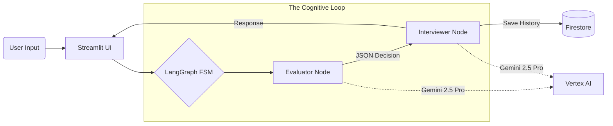

# 🤖 The System Design Interviewer (Agentic AI)

**A stateful, cognitive AI agent that conducts technical system design interviews using LangGraph and Gemini 2.5 Pro.**

[]()
[]()
[]()

## 📖 Overview

"The Interviewer" is Project 3 of the SRF Portfolio Trilogy. Unlike standard chatbots that simply react to the last user message, this application implements a **Cognitive State Machine**. It mimics a Principal Software Architect conducting a high-stakes interview.

Before the AI speaks, it enters a "Thinking Phase" (Evaluator Node) to analyze the candidate's answer for depth, accuracy, and trade-offs. It then dynamically decides whether to **Pass** the candidate to the next topic, **Probe** for more details, or **Fail** the response.

### 🌟 Key Features
*   **Agentic Workflow:** Built on **LangGraph**, utilizing a cyclic graph architecture (`Evaluator` $\leftrightarrow$ `Interviewer`).
*   **"Glass Box" UI:** The Streamlit sidebar reveals the agent's internal monologue, showing the user exactly how their answer was graded (Pass/Probe/Fail) and the critique generated by the AI.
*   **Persistent State:** Uses **Google Cloud Firestore** to maintain conversation history and state across serverless container restarts.
*   **Serverless Architecture:** Fully containerized and deployed on **Google Cloud Run** for auto-scaling zero-maintenance infrastructure.

---

## 🏗️ Architecture

The application moves beyond linear chains into a **Finite State Machine (FSM)**.



### The Logic Loop
1.  **User Input:** "I would use a Load Balancer."
2.  **Evaluator Node:** Analyzes the input.
    *   *Thought:* "Correct, but vague. Needs to specify algorithms."
    *   *Decision:* `PROBE`
3.  **Interviewer Node:** Receives the instruction to probe.
    *   *Output:* "That is correct, but how would you distribute the traffic? Round Robin? Least Connections?"

---

## 🛠️ Tech Stack

| Component | Technology | Reasoning |
| :--- | :--- | :--- |
| **Orchestration** | **LangGraph** | Enables cyclic, stateful workflows essential for "active" interviewing. |
| **LLM** | **Gemini 2.5 Pro** | Selected for superior reasoning capabilities via Google Vertex AI. |
| **Memory** | **Cloud Firestore** | Serverless NoSQL database for persisting session history in a stateless container environment. |
| **Frontend** | **Streamlit** | Rapid UI development with support for session state management. |
| **Infrastructure** | **Google Cloud Run** | Scale-to-zero container hosting (Docker). |

---

## 🚀 Getting Started

### Prerequisites
*   Python 3.12+
*   Google Cloud Platform Account (with Vertex AI and Firestore enabled)
*   `gcloud` CLI installed and authenticated

### 1. Installation

```bash
# Clone the repo
git clone https://github.com/SRFDev/interviewer-ai-agent.git
cd interviewer-ai-agent

# Create virtual environment
python -m venv .venv
source .venv/bin/activate

# Install dependencies
pip install -r requirements.txt
```

### 2. Configuration
Create a `.env` file in the root directory:

```ini
GCP_PROJECT_ID="your-project-id"
GCP_REGION="us-east4" # App location
VERTEX_MODEL_ID="gemini-2.5-pro"
```

### 3. Run Locally

```bash
# Ensure the root is in the python path
PYTHONPATH=. streamlit run app/ui.py
```

---

## ☁️ Deployment (Google Cloud Run)

This project uses **Multi-Stage Docker Builds** to minimize image size and **Artifact Registry** for storage.

### 1. Build & Push
```bash
# Create the Artifact Registry (One time)
gcloud artifacts repositories create interviewer-repo --repository-format=docker --location=us-east4

# Submit Build to Cloud Build
gcloud builds submit --tag us-east4-docker.pkg.dev/[PROJECT_ID]/interviewer-repo/interviewer-agent .
```

### 2. Deploy Service
```bash
gcloud run deploy interviewer-agent \
  --image us-east4-docker.pkg.dev/[PROJECT_ID]/interviewer-repo/interviewer-agent \
  --region us-east4 \
  --allow-unauthenticated \
  --set-env-vars="GCP_PROJECT_ID=[PROJECT_ID],GCP_REGION=us-central1,VERTEX_MODEL_ID=gemini-2.5-pro"
```
*Note: We route `GCP_REGION` to `us-central1` for the LLM to access the latest Gemini models while keeping the app hosting in `us-east4`.*

---

## 🧠 Design Decisions & Trade-offs

### Why No RAG?
Unlike Project 1 ("Howie"), which focused on retrieval, this project focuses on **Agency**. The goal was to demonstrate an LLM's ability to maintain a mental model of a conversation without needing external documents. The "Knowledge" is the LLM's intrinsic training; the "Skill" is the state management.

### Why Firestore?
Running stateful agents on serverless containers (Cloud Run) is tricky because the container memory is wiped when it scales down. Redis was considered, but **Firestore** provided a serverless, native integration with LangChain (`FirestoreChatMessageHistory`) that fits within the GCP free tier.

---

## 📜 License
MIT License. Copyright © 2026 SRF Development.